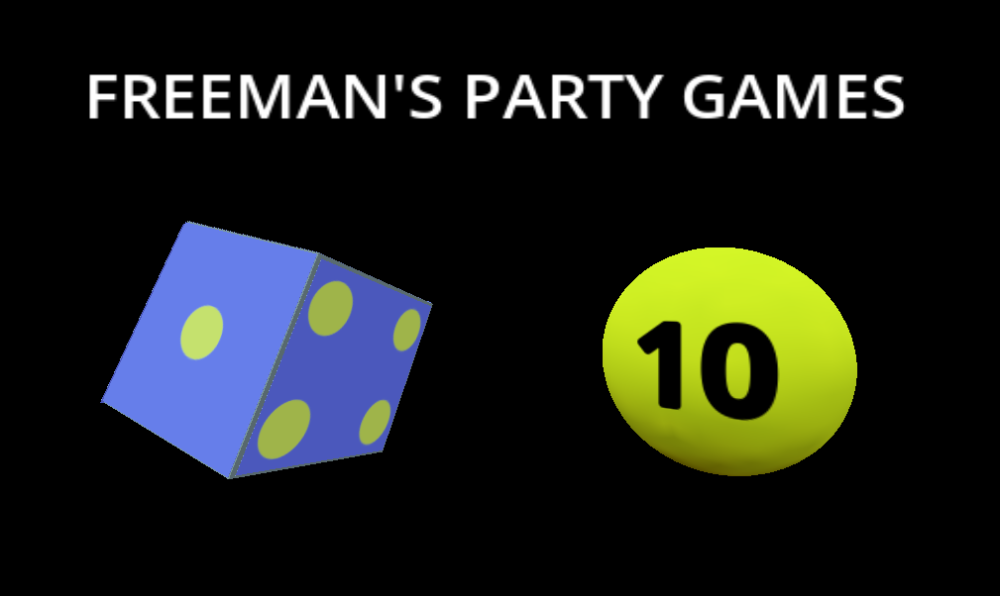
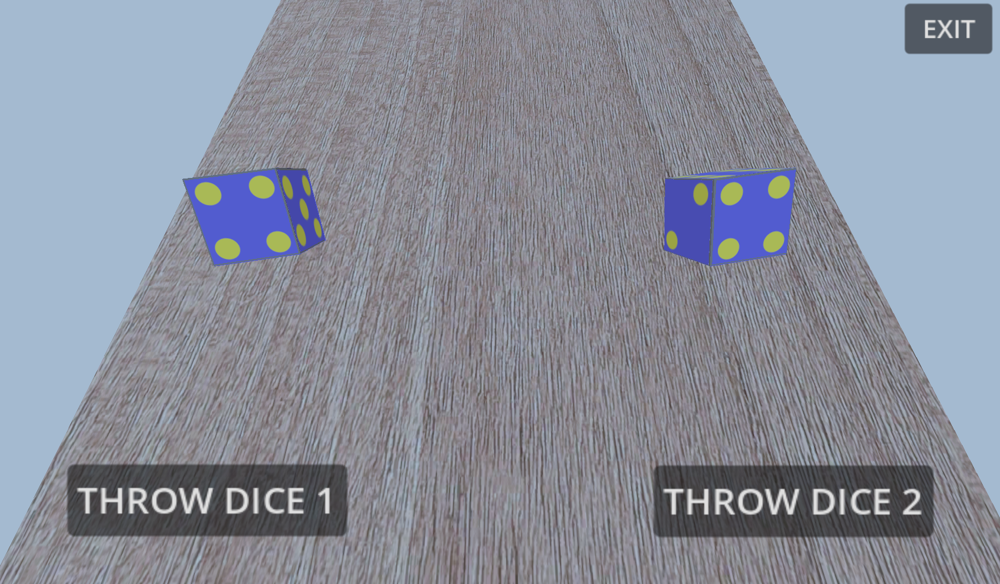
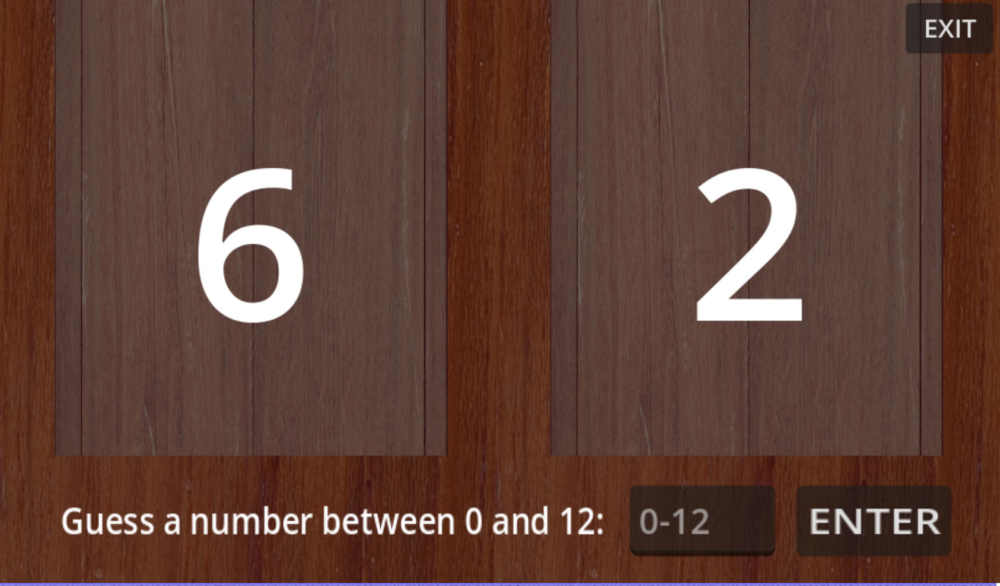
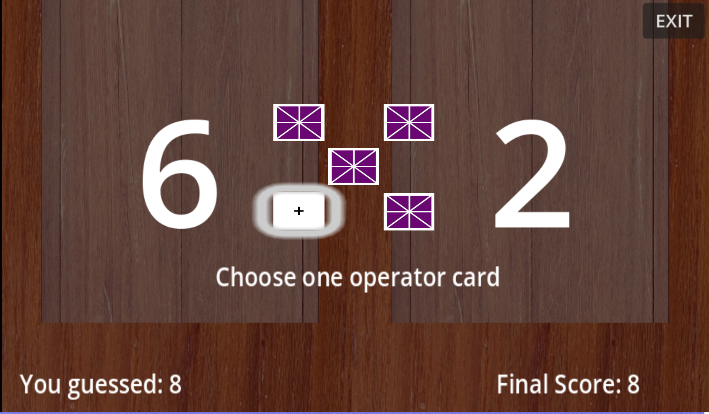
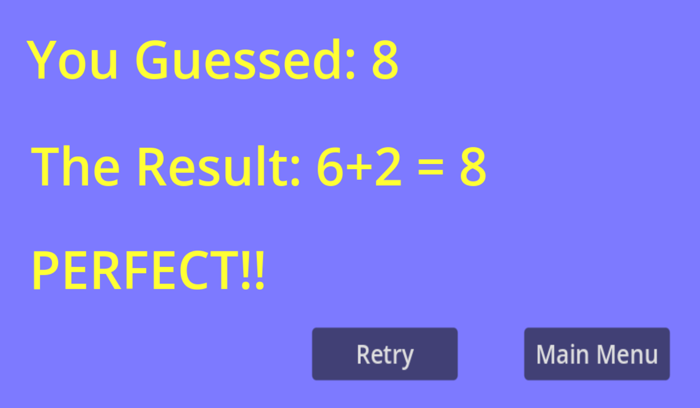
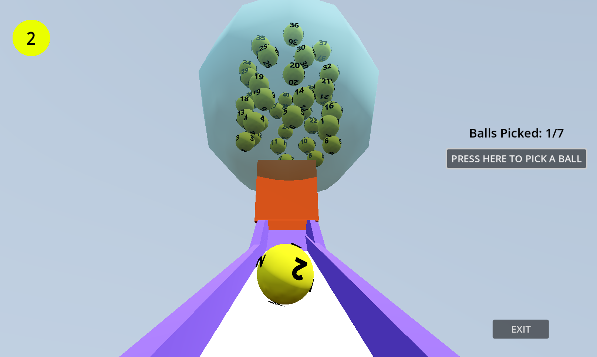

# Freeman's Party Games
A Collection of Small Party Games: Created by Me with Godot Engine

      

<h2>Play the HTML5 Version For Free on Itch.io</h2>

https://henrysfriman.itch.io/freemans-party-games

<h2>Introduction</h2>

I created this game as my first project on the Godo Engine.

It all started with a funny dice game idea I had created in my head. When I started bringing that idea to life, I asked to create a lotto number generator.

This is the reason why this game is a collection of both the dice game and the lotto generator.

<h2>Game 1: Dice Game</h2>
<ul>
  <li>Throw two dices</li>
  <li>Guess what their outcome could be (between 1-12)</li>
  <li>Draw one of the five operator cards: addition (+), substraction (-), multiplication (*), division (/) and exponentation (^).</li>
  <li>The final result will be in the following  form: [dice 1] [operator] [dice2]. Find out if your guess was correct!</li>
</ul>

     
     
     
     
     

<h2>Game 2: Lotto Generator</h2>
<ul>
  <li>This is a simulation of a lottery ball machine.</li>
  <li>Generate 7-randomly picked numbers and use them however you want: for real-life Lotto or just for fun.</li>
  <li>Please note: this is just a simulation, and the numbers are generated randomly. Please be cautious if you use this for any serious or commercial purposes.</li>
</ul>

     

